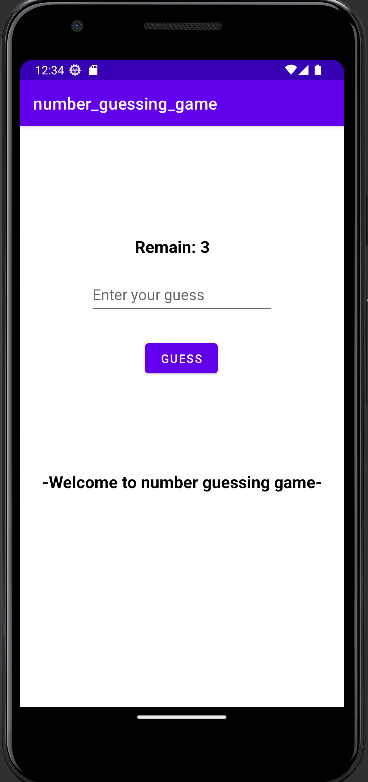
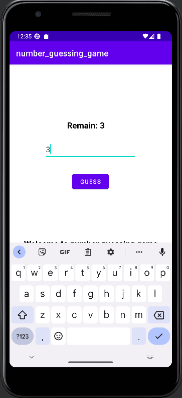
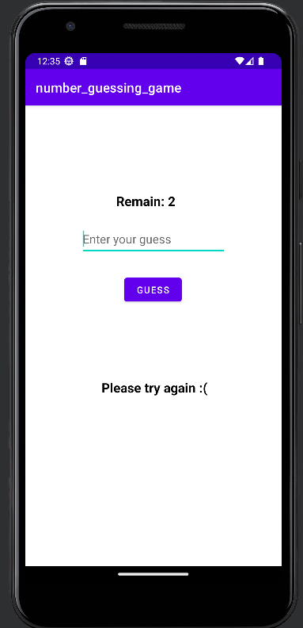
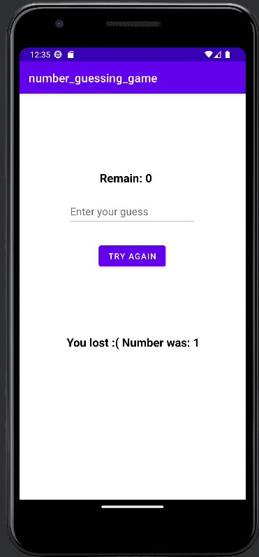
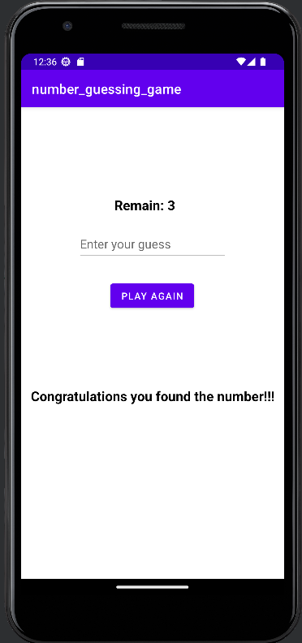
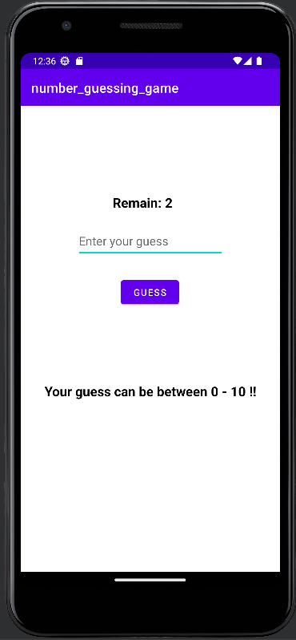

# Number Guessing Game

I wrote a simple number guessing game that I didn't spend time for designing.

- # Home Page

This is how the game starts. The initial number of guesses is 3.

- # Guess

You can make a guess by entering your guess and pressing the guess button.

- # Wrong Guess

When you guess incorrectly, your remaining amount is reduced by 1 and an error message is given.

- # Failure Situtation

If you don't get all 3 guesses, you will lose the game and the number will be shown to you. Then the "try again" button will appear.

- # Success Situtation

If you can find the number within 3 tries, you win the game.

- # Rule

The number you enter must be between 0 and 10, otherwise your number of attempts will be reduced by 1 and a warning will be given.
